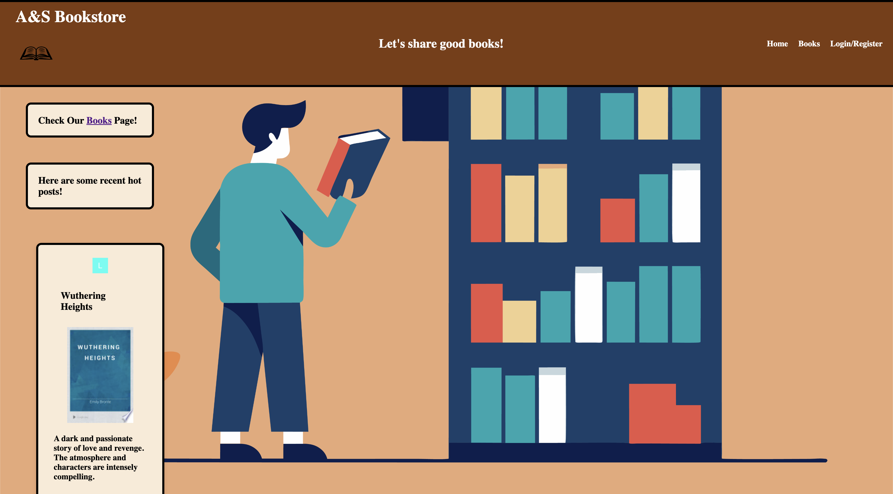
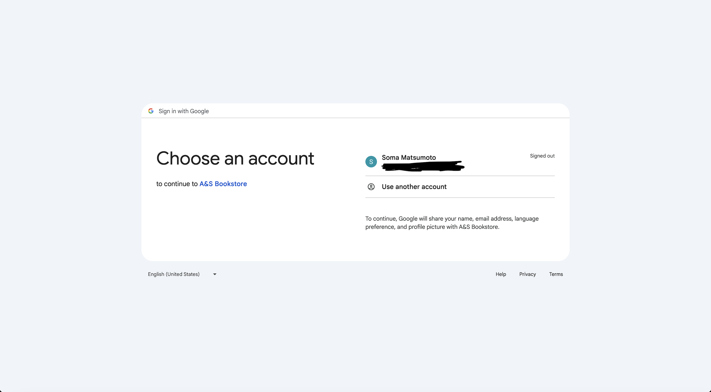
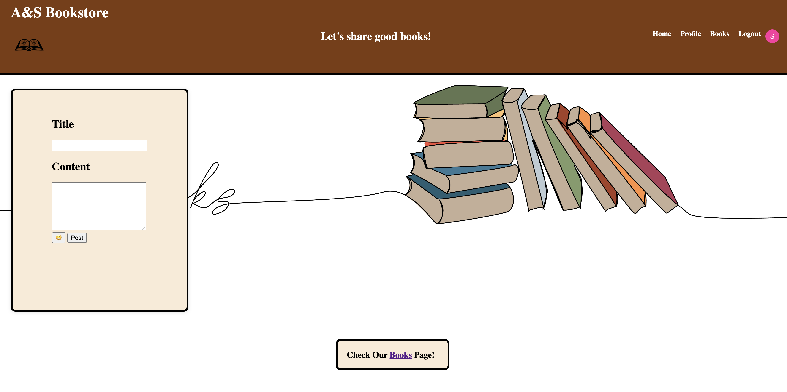
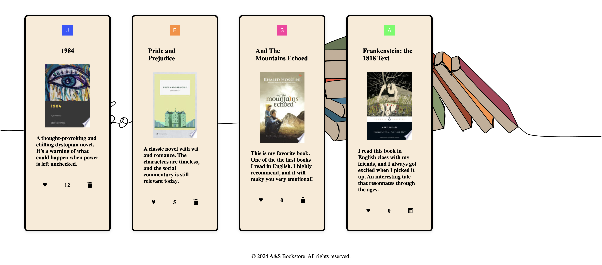
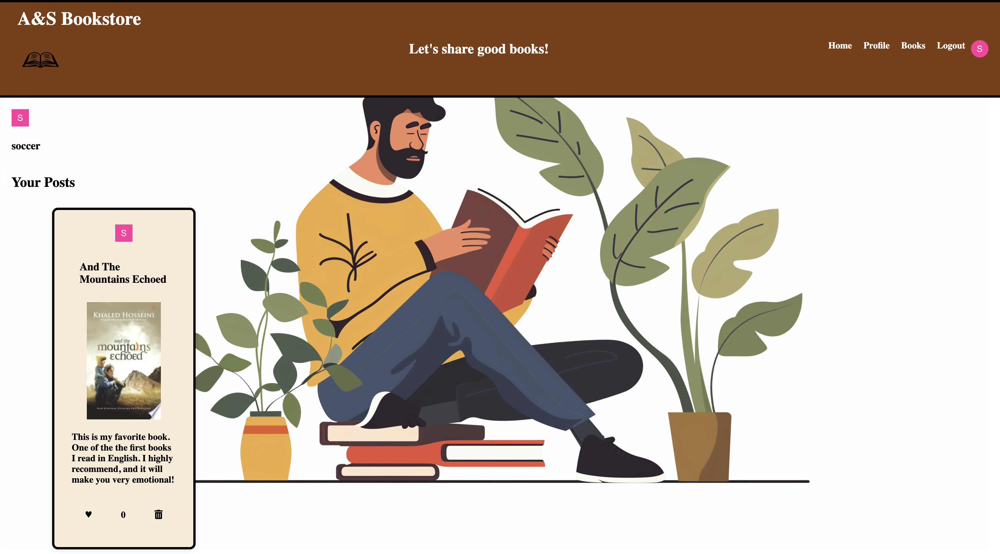

# A&S Bookstore - Share Your Favorite Books!
This is a public version of our project for ECS 162. It is designed to run on localhost.

## Description

A&S Bookstore is a platform where book lovers can come together and share their favorite reads. With a simple and intuitive interface, users can:
- Post reviews of their favorite books
- Browse books recommended by others

## Features

- **Google OAuth Authentication**: Secure and easy login using your Google account.
- **User-Friendly Interface**: A clean and modern design that is easy to navigate.
- **Book Sharing**: Post and browse book recommendations from other users.

## Screenshots

  
  
  
  
  

## Prerequisites

- [Node.js](https://nodejs.org/)
- Google account for OAuth
- Emoji API Key (if you want to use the Emoji feature)
- Google OAuth Client ID and Secret Key

## Authors

Alex Ngo 

Soma Matsumoto 

## Credits

All background images used in this project are from Adobe Stock royalty-free images.
The book cover images used in this project are sourced from the Google Books API.

## Legal Notice

The book cover images displayed in this project are provided by the Google Books API. All rights to the book cover images are owned by their respective copyright holders. The images are used under the terms specified by the Google Books API.

## License

This project is licensed under the MIT License. See the LICENSE file for details.
